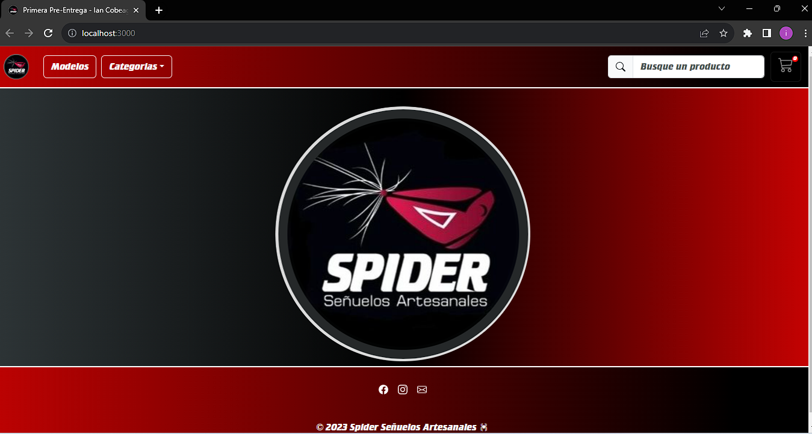

# Spider señuelos artesanales 🕷

## Introduccion al producto

Un proyecto orientado en un negocio familiar, se trata de la venta de señuelos artesanales. El señuelo es un producto utilizado para la pesca deportiva, simulando el movimiento de una presa, llamando la atención del pez atrayéndolo hacia el anzuelo. Este e-commerce busca exhibir los productos, donde el usuario podrá realizar busquedas por nombre, filtrar por categorias, armar su propio carrito de productos y realizar la compra correspondiente.

## Presentacion personal

Mi nombre es Ian Leonel Cobeaga, soy un desarrollador junior que busca especializarse en las tecnologías más utilizadas en el mercado. Me recibi en el Instituto Tecnológio ORT y actualmente soy trabajo en NTT DATA ARGENTINA
### LinkedIn
**[Ian Leonel Cobeaga](https://www.linkedin.com/in/iancobeaga/)**
## Instalación

* Un pre-requisito es tener instalado como minimo la v18.17.0 de node.js (La versión utilizada en este proyecto).
1) iremos hacia el [repositorio del proyecto](https://github.com/IanCobeaga/PreEntrega1-IanCobeaga). 

    

    Luego como indica la imagen de aquí abajo, nos dirigimos hacia el boton code, donde se desplegará un menu donde nos permitirá copiar la url del proyecto.

    

2) En la consola de tu preferencia (cmd, powershell, bash), ubicandote en el directorio que desees pondrás el comando `git clone https://github.com/IanCobeaga/PreEntrega1-IanCobeaga`, esto traera todos los archivos del proyecto para correrlos y modificarlos localmente. 

    Por ultimo, el comando `npm install`, dentro del mismo directorio (siempre revisar en que directorio estamos parados), que será el encargado de instalar todas las dependencias de node que se encuentran en el package.json. Generando la carpeta node_modules.

## Ejecución

 La ejecución se realizará colocando el comando `npm start` (ya que es el configurado por default en node/react.js) dentro del mismo directorio del proyecto.

 Debe quedar algo así:

 

Por ultimo, se abrirá tu navegador predeterminado, corriendo la aplicación en el puerto [3000](http://localhost:3000).

## Flujo de la aplicación

Se deja una demo de como es el flujo del proyecto, donde se abarcan las siguientes funcionalidades:

* **Navegabilidad sugerida en los requerimientos del proyecto**
* **Renderizado de todos los productos obtenidos de la BD**
* **Filtrado de productos por categorias**
* **Vista individual del producto**
* **Renderizados condicionales (boton agregar carrito - componente de carga - entre otros)**
* **Estilos implementados con bootstrap v5.3 - (offCanvas para el carrito - footer con redes sociales oficiales - entre otros)**
* **Buscador con componente dropdown renderizando los objetos matcheados**
* **Contabilizador del precio total del producto y del precio total de la compra**
* **Guardado de la compra en la BD con los datos sugeridos en los requerimientos del proyecto**

